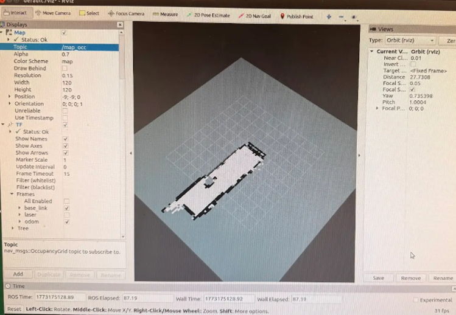

# Autonomous RC Car

A self-driving RC car platform built on a Jetson Nano, featuring LiDAR-based mapping, RGB-D camera vision, IMU sensor fusion, and motor control via a VESC motor controller. The system is capable of real-time environment sensing, occupancy grid mapping, PD wall-following control, and autonomous obstacle avoidance.

---

## How It Works

The Jetson Nano acts as the central computer, processing sensor data from the LiDAR, IMU, and RGB-D camera in real time. A VESC motor controller receives drive commands from the Jetson Nano via a low-level UART driver and handles throttle and steering. A ROS-based software stack fuses sensor data to localize the vehicle, build an occupancy grid map of the environment, and execute autonomous wall-following navigation with obstacle avoidance.

```
[ LiDAR ] ──┐
[ IMU   ] ──┼──► [ Jetson Nano (ROS) ] ──► [ VESC ] ──► [ Motors ]
[ Camera] ──┘
```

---

## Hardware

| Component | Notes |
|---|---|
| RC car chassis | 1/10 scale chassis with servo steering |
| NVIDIA Jetson Nano | Onboard computer — runs all perception and control code |
| LiDAR sensor | Environment scanning, wall-following, and obstacle detection |
| BNO055 IMU | Provides yaw correction for odometry and sensor fusion |
| Intel RealSense RGB-D Camera | Depth image capture for detecting obstacles undetectable by LiDAR |
| VESC motor controller | Receives UART commands from Jetson Nano, drives the motors |

---

## What Was Implemented

### UART Motor Driver
A low-level UART driver was written in C++ on Linux to communicate between the Jetson Nano and the VESC motor controller, dispatching real-time throttle and steering commands.

### Sensor Transforms & Fusion
Homogeneous transformations were computed between the `base_link` frame and each sensor frame (LiDAR, IMU, RGB-D camera) using quaternion-based rotations. These were published as static ROS transforms, and the BNO055 IMU yaw output was used to replace raw wheel odometry heading, significantly reducing localization drift. LiDAR–IMU–odometry fusion achieved **<2 cm RMS localization error** validated against live deployment data.

### Occupancy Grid Mapping
A probabilistic occupancy grid mapping node was built in Python + ROS, fusing live LiDAR scans with IMU-corrected odometry poses. Each cell's state is updated using a recursive log-odds model, classifying cells as occupied, free, or unknown based on tunable probability thresholds.

Initial testing with default parameters produced noisy, unrecognizable maps. After tuning `p_occ` from 0.75 → 0.9, `p_free` from 0.25 → 0.1, and increasing `map_res` from 0.1 m → 0.15 m, the algorithm produced significantly cleaner and more consistent results:



The final map captured during hallway testing, alongside the real environment being mapped:


### PD Wall-Following Controller
A PD controller was implemented to center the vehicle between hallway walls using the differential LiDAR distance measurements (d_l and d_r). Gains were tuned experimentally to balance responsiveness and stability across straight segments and corners.

### Obstacle Avoidance & Velocity Control
An exponential velocity decay safety layer was added, smoothly decelerating the vehicle as obstacles approach and commanding a full stop within a defined safety distance. A virtual barrier navigation algorithm was also implemented to find the largest gap in the LiDAR field of view and steer toward it for obstacle avoidance.

During real-world testing, an edge case was identified where an accessibility ramp opening beside the obstacle course caused the algorithm to misidentify it as the best direction of travel. This highlighted a known limitation of pure gap-finding approaches in environments with large side openings:


This was addressed by narrowing the FOV angle and increasing `d_safe` to detect side walls as obstacles sooner, directing the vehicle toward the correct forward path.

### RGB-D Camera Integration
The barrier navigation node was extended to subscribe to the RealSense depth image and camera info topics. Depth image pixels are projected into 3D space using camera intrinsic parameters, identifying potential collision points undetectable by the 2D LiDAR scan plane and overriding LiDAR-based decisions when necessary.

---

## Project Structure

```
autonomous-rc-car/
├── src/
│   ├── vesc_control.py         ← low-level UART driver for throttle and steering commands
│   ├── lidar_reader.py         ← reads and processes LiDAR scan data
│   ├── camera_stream.py        ← captures depth frames and projects pixels to 3D points
│   ├── imu_reader.py           ← reads BNO055 yaw data for odometry correction
│   ├── sensor_fusion.py        ← fuses LiDAR, IMU, and odometry via homogeneous transforms
│   ├── occupancy_grid.py       ← ROS node for probabilistic occupancy grid mapping
│   ├── wall_follower.py        ← PD controller for wall-following and obstacle avoidance
│   └── main.py                 ← main control loop
├── images/
│   ├── occupancy_grid_result.png
│   ├── hallway_map_final.png
│   └── obstacle_layout.png
├── config/
│   └── settings.py             ← UART ports, speed limits, sensor config, grid parameters
└── README.md
```

---

## Key Parameters

### Occupancy Grid
| Parameter | Value | Description |
|---|---|---|
| `p_occ` | 0.9 | Probability threshold to classify a cell as occupied |
| `p_free` | 0.1 | Probability threshold to classify a cell as free |
| `map_res` | 0.15 m | Grid cell size — larger reduces noise but loses fine detail |
| `map_width` / `map_height` | 120 | Grid dimensions in cells |

### Wall-Following & Obstacle Avoidance
| Parameter | Value | Description |
|---|---|---|
| `kp` | 4 | Proportional gain — higher values increase steering responsiveness |
| `kd` | 4 | Derivative gain — higher values increase damping, reduce overshoot |
| `v_nominal` | 1.0 m/s | Nominal cruising speed |
| `d_stop` | 0.4 m | Distance at which vehicle comes to a complete stop |
| `d_safe` | 2.0 m | Distance at which objects are flagged as obstacles |
| `fov_angle` | 70° | LiDAR field of view used for gap detection |

---

## Limitations

- Occupancy grid mapping assumes a **static environment** — moving obstacles such as pedestrians may linger on the map due to accumulated log-odds history
- Wheel odometry is susceptible to **drift** from wheel slip, which accumulates over longer travel distances
- IMU yaw may be affected by **magnetic interference** from nearby electronics, causing misaligned LiDAR grid projections
- LiDAR provides **2D scanning only** — the RGB-D camera compensates for obstacles above or below the scan plane, though full sensor fusion validation in a unified environment was not completed

---

## Possible Improvements

- Implement a **Kalman filter** combining odometry, IMU, and LiDAR to further reduce localization drift
- Add **cell decay logic** to the occupancy grid so free space is recovered over time, improving dynamic obstacle handling
- Apply **LiDAR point averaging** to smooth perceived wall geometry and reduce the impact of door frames and reflective surfaces on the control law
- Use the **ROS Navigation Stack** as a higher-level planning and control framework
